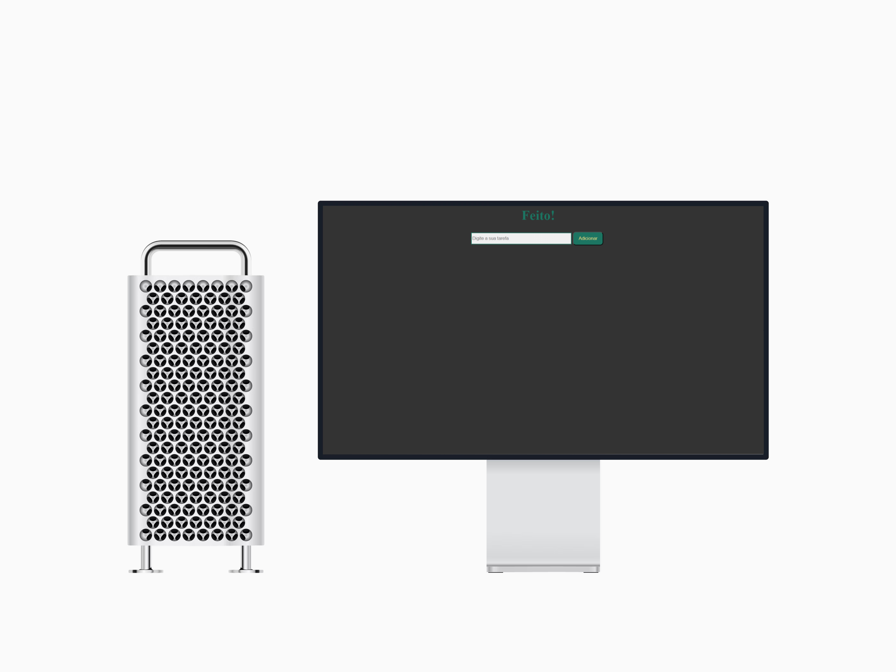

<h1>Projeto To do List</h1>

Este projeto é uma aplicação simples de lista de tarefas, onde o usuário pode adicionar tarefas, marcá-las como concluídas ou removê-las da lista.

<h2>Linguagens usadas</h2>

O projeto foi desenvolvido com as linguagens HTML, CSS e JavaScript, com o objetivo de ajudar o usuário a organizar suas tarefas de forma ordenada.

<h2>Funcionalidades</h2>

O site permite que o usuário adicione uma nova tarefa inserindo um texto na caixa de entrada e clicando no botão adicionar, cada tarefa adicionada aparece na lista e ao lado de cada tarefa há um botão para removê-la. O usuário pode visualizar suas tarefas pendentes e todas as ações são realizadas de forma simples e intuitiva.

<h2>Let's plan on your notebook and smartphone</h2>
<h1>SMARTPHONE</h1>

<h1>DESKTOP</h1>

